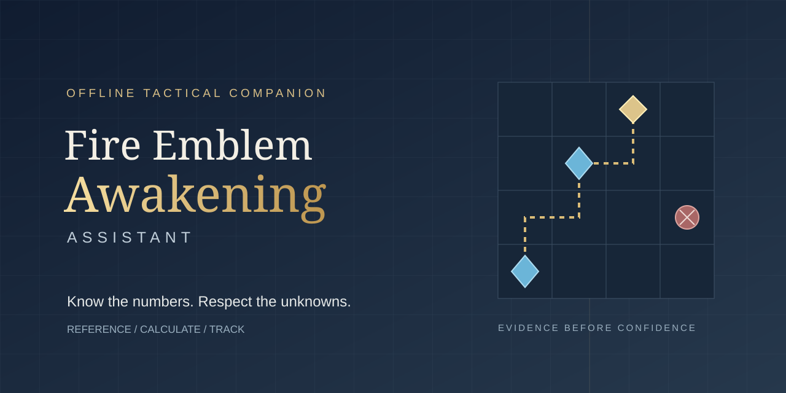

<p align="center">
  
</p>

<h1 align="center">Fire Emblem Awakening Assistant</h1>

<p align="center"><strong>An offline tactical reference and playthrough companion that keeps uncertainty visible.</strong></p>

<p align="center">
  <a href="https://github.com/cntrl-alt-lenny/fire-emblem-awakening-assistant/actions/workflows/ci.yml"></a>
  <a href="docs/usage.md"></a>
</p>

## What is this?

A local knowledge base and Python toolkit for Fire Emblem Awakening: look up mechanics, calculate supported combat outcomes, and track your actual army. It runs on Linux and macOS, entirely offline with Python's standard library; no installation, account or API key is required.

The Hard/Classic reference distinguishes supported facts, conflicts and missing evidence. **No complete reinforcement schedule or whole-map safety guarantee is certified.** Passing tests checks structure and modeled behavior; it does not prove every game fact. Read [coverage and limitations](STATUS.md) before relying on tactical advice.

## Quick start

1. Clone this repository and open its folder.
2. Check the reference and tools:

   ```sh
   make audit
   python3 tools/knowledge.py weapons "Iron Sword"
   python3 tools/combat_calculator.py examples/battle.json
   ```

3. Read the [usage guide](docs/usage.md) for tracking and more calculations. A playthrough starts only when you request one and supply your actual state.

Without `make`, run the three validation scripts listed in the [contributing guide](CONTRIBUTING.md), followed by the unittest command. Native Windows tracking is currently unsupported; use Linux through WSL for the full toolkit.

## What works

- **Reference:** characters, classes, equipment, skills, supports and source IDs.
- **Combat:** supported observed-input duels, explicit refusals and worst-case HP.
- **Progression:** Pair Up, forging, growth expectations and selected EXP/staff calculations.
- **Run tracking:** actual stats, inventory, deaths and an atomic event ledger.
- **Hard map queries:** phase-aware arrivals, hazards and unresolved conflicts.

Full paired outcomes, complete enemy geometry and many proc interactions remain unsupported. Reference commands can contain tactical or story spoilers; [agent instructions](AGENTS.md) define the response filters.

## Documentation

- [Usage and tools](docs/usage.md)
- [Coverage and limitations](STATUS.md) · [Hard map coverage](docs/map-coverage.md)
- [Combat formulas](docs/combat-formulas.md) · [Hard reinforcements](docs/hard-reinforcements.md)
- [Sources](SOURCES.md) · [Unresolved questions](research/UNCERTAINTIES.md)
- [Contributing](CONTRIBUTING.md) · [Agent instructions](AGENTS.md)
- [Agentic framework](docs/agents/FRAMEWORK.md) · [Standing decisions](docs/state.md)

## Credits and license

An unofficial fan project. Fire Emblem Awakening and related names belong to Nintendo and Intelligent Systems. No ROMs, game binaries, extracted game assets or complete guide pages are included. Factual records cite their sources; use your own game copy for play.

No project-wide license has been selected. Source materials retain their respective rights. Installed framework files carry the [upstream MIT license](docs/agents/local/framework-LICENSE) separately.
